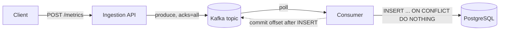

# Architecture

## Overview

The Telemetry Pipeline ingests numeric metric events over HTTP, buffers them
durably in Kafka and stores them in PostgreSQL for querying. Ingestion is
decoupled from storage: the API only confirms that an event is durably stored
in Kafka, and a separate consumer writes it to the database asynchronously.

## Components and data flow

| Component | Responsibility |
|---|---|
| Client | Generates a UUIDv7 `id` on the first attempt and reuses it on every retry. Retries on `503`, on timeouts and on lost responses, with exponential backoff and jitter. |
| Ingestion API | Decodes and validates the event, rejecting anything the database would reject. Produces valid events to Kafka and maps the outcome to an HTTP status. Holds no state. |
| Kafka | Durable buffer between ingestion and storage. Replication factor 3, `min.insync.replicas=2`, unclean leader election disabled. |
| Consumer | Reads events, inserts them idempotently into PostgreSQL and commits the offset only after the insert succeeds. |
| PostgreSQL | System of record. The primary key on `id` is the final deduplication point. |

## Acknowledgement boundaries

| Step | Who confirms | What it guarantees |
|---|---|---|
| Kafka ack | Partition leader, after every replica in the current ISR has the record and the ISR has at least `min.insync.replicas` members | The event survives the loss of one broker. |
| `202 Accepted` | Ingestion API, only after the Kafka ack | The client may discard the event. It does not mean the event is in PostgreSQL or visible to queries. |
| Offset commit | Consumer, only after the `INSERT` succeeds | The event is in PostgreSQL. It will not be reprocessed after a restart. |

The durability guarantee is bounded by `min.insync.replicas - 1 = 1` broker
failure. If two brokers fail, writes are refused (`503`). Events that were
acknowledged while the ISR had only two members may then be unavailable until
one of those brokers returns. With unclean leader election disabled they are
not lost unless the brokers' disks are lost too.

See [ADR 0001](adr/0001-ingestion-ack-boundary.md).

## Delivery semantics and duplicates

Delivery is at-least-once. Duplicates are expected and neutralized at storage.

Duplicates can originate from:

1. **Lost response.** Kafka acknowledged the event, but the API crashed or the
   `202` was lost in the network. The client retries.
2. **Ambiguous produce timeout.** The API times out waiting for Kafka and
   returns `503`, but the record was in fact written. The client retries. This
   happens without any process crashing.
3. **Producer retries.** The Kafka client resends a batch whose ack was lost.
   The idempotent producer (`enable.idempotence=true`) removes this case inside
   Kafka, but it does not cover cases 1 and 2.
4. **Consumer reprocessing.** The consumer crashes, or the group rebalances,
   after the `INSERT` and before the offset commit.

In every case the duplicate carries the same client-generated `id`. The
consumer inserts with `ON CONFLICT (id) DO NOTHING`, treats the duplicate as
success, commits the offset, and logs and counts `RowsAffected() == 0`.
Without the conflict clause, error `23505` would block the partition (poison
message).

See [ADR 0002](adr/0002-event-schema-and-idempotency.md).

## HTTP contract (target)

`POST /metrics` with a JSON body:

| Field | Type | Rules |
|---|---|---|
| `id` | string | Required. UUIDv7, generated by the client and reused on retries. |
| `timestamp` | integer | Required. Unix time in seconds; `0` is a present value. Must be within the range PostgreSQL accepts; the accepted past/future window is still open. |
| `key` | string | Required. Not empty, at most 255 characters, no NUL bytes. |
| `value` | number | Required. Double precision; `0` is a present value. |

| Status | Meaning | Contacts Kafka |
|---|---|---|
| `202 Accepted` | Event durably stored in Kafka. | Yes |
| `400 Bad Request` | Invalid JSON, missing field or rule violation. Do not retry. | No |
| `405 Method Not Allowed` | Method other than `POST`. | No |
| `503 Service Unavailable` + `Retry-After` | Kafka unavailable or ack timeout. Retry with the same `id`. | Yes (attempted) |

## Data model

One table, `event`, defined in
[`migrations/0001_create_event.sql`](../migrations/0001_create_event.sql):

- `id uuid` — primary key, deduplication point.
- `key varchar(255)` — not empty (`CHECK`).
- `value double precision`.
- `event_time timestamptz` — set by the client (`timestamp` in the API).
- `ingested_at timestamptz default now()` — set by the database;
  `ingested_at - event_time` measures end-to-end latency.

## Current state vs. planned

| Area | Today | Planned |
|---|---|---|
| HTTP API | `POST /metrics` validates `timestamp`, `key` and `value`; returns `200`, `400` or `405`. Graceful shutdown in `cmd/telemetry`. | `id` field, all ADR 0002 validations, `202`/`503` responses. |
| Kafka | Not implemented. | Producer with `acks=all` and idempotence (Week 7). |
| Consumer | Not implemented. | Idempotent insert, offset commit after insert (Weeks 7–8). |
| PostgreSQL | Schema in `migrations/`, not applied by the application. | Migrations and integration tests (Week 6). |
| Operations | Local `go run`. | Docker Compose, metrics, logs and traces (Weeks 9–11). |

## Decisions and open questions

Decisions:

- [ADR 0001 — Ingestion acknowledgement boundary](adr/0001-ingestion-ack-boundary.md)
- [ADR 0002 — Event schema and idempotency](adr/0002-event-schema-and-idempotency.md)

Open questions:

- Accepted window for past and future `timestamp` values.
- Kafka partition key: `key` would keep per-metric ordering, while `id` would
  spread load evenly.
- Dead-letter handling for events that fail for reasons other than duplicates
  (Week 8).
- Textual events (such as syslog) as a future extension of the contract.
